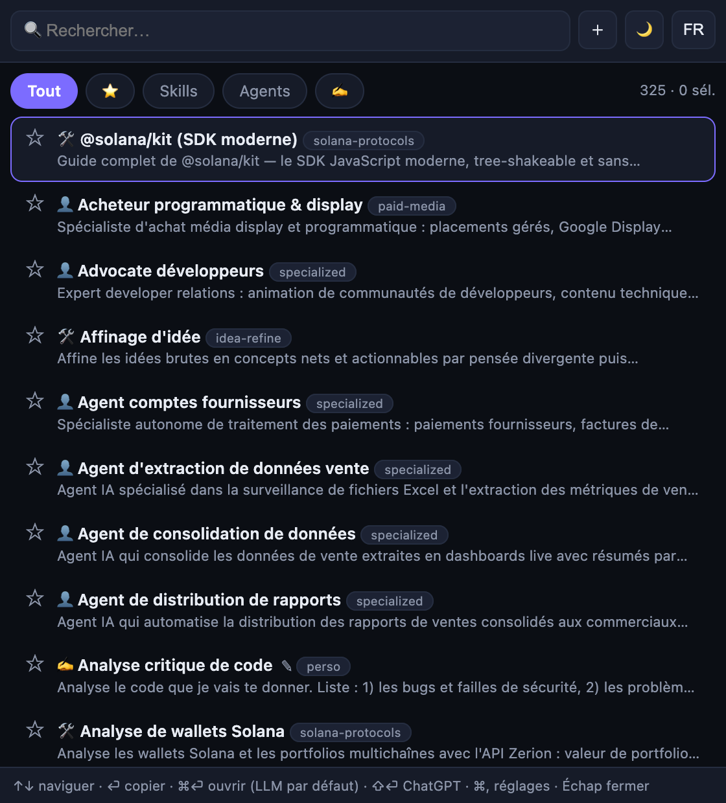
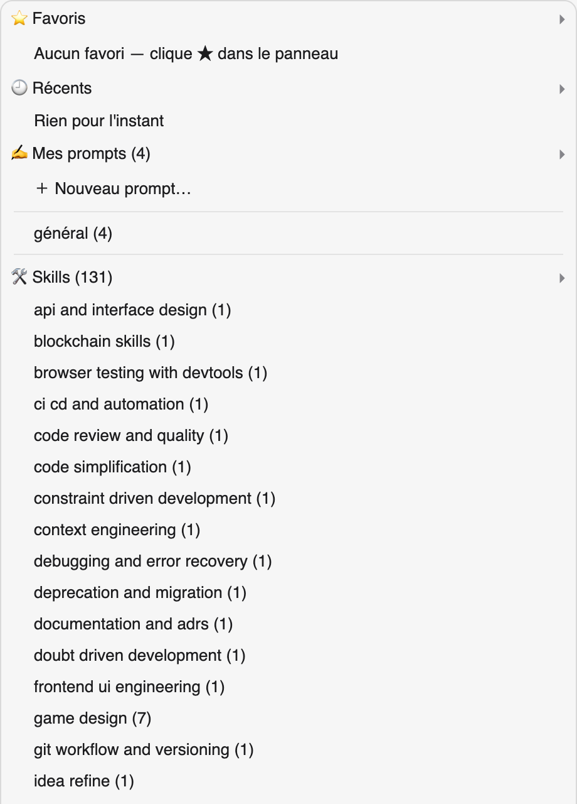
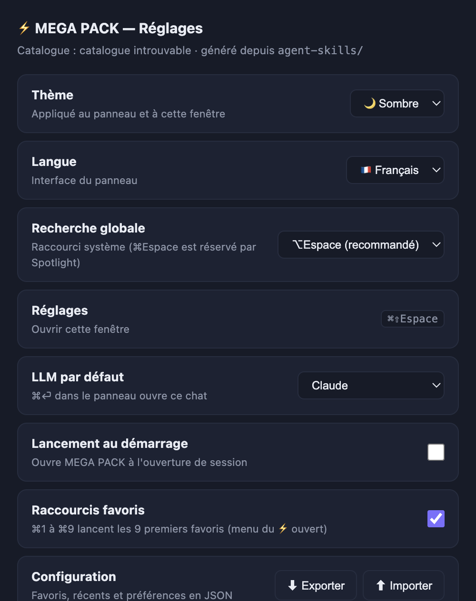

<div align="center">

# ⚡ PromptDeck

**131 skills + 190 agents IA dans ta barre de menus macOS — en un ⌥Espace.**

Recherche instantanée, prompts personnalisés, envoi vers 12 destinations
(Claude, ChatGPT, Freebuff, OpenCode…) en un clic.

[](#-installation)
[](https://github.com/Azumizeus/PromptDeck/actions/workflows/ci.yml)
[](#-installation)
[](#-installation)
[](LICENSE)
[](#)
[](agent-skills/menubar-app/test-all.sh)

</div>

---

## ✨ C'est quoi ?

PromptDeck est une **app menu-bar macOS** (icône ⚡ en haut à droite) qui transforme
une bibliothèque de **131 skills** et **190 agents IA** en lanceur instantané :

| | |
|---|---|
| 🔍 **Recherche bilingue** | 321 items filtrés en temps réel, en français comme en anglais (« jupiter », « multi-chaînes »…) |
| ✍️ **Prompts personnalisés** | Crée tes propres prompts, avec **tags**, importés par **glisser-déposer** (.md/.txt) ou exportés en .md |
| 🌐 **12 destinations** | Claude · ChatGPT · Perplexity · Copilot · DeepSeek · Z.ai · Kimi · Mammouth.ia · Freebuff (app) · OpenCode (desktop) · OpenCode (terminal) · Presse-papiers |
| ⭐ **Favoris + ⌘1-⌘9** | Épingle tes items et lance les 9 premiers au clavier |
| 🕘 **Récents** | Tes 8 derniers prompts toujours à portée de clic |
| 🧩 **Composeur** | Multi-sélectionne skills + agents + prompts → un prompt combiné unique |
| 💡 **Tooltip expert** | Survol d'un skill/agent : type, description complète, catégorie, compétences |
| 🖱️ **Clic droit multi-LLM** | Menu flottant : envoi vers **plusieurs destinations choisies** dans les Réglages, copier, favori |
| 📄 **Dossier MEGA PROMPT** | Tout le catalogue en fichiers `.md` sur le disque (`skills/`, `agents/`, `perso/`) — clic droit → **Créer le .md** ou **Ouvrir le dossier** en un clic |
| 🛠 **Atelier IA** | Crée tes propres agents & skills **générés par IA** (Groq, OpenAI, Anthropic, OpenRouter, Ollama…) avec option « senior orchestrateur » |
| ⚙️ **Réglages complets** | Thème clair/sombre, FR/EN, LLM par défaut, raccourci personnalisable, lancement au démarrage, export/import de config |

Le tout **100 % local** : pas de compte, pas de télémétrie, aucun envoi de données.

## 🤔 Pourquoi PromptDeck ?

### Le problème

Les meilleures bibliothèques de skills et d'agents IA finissent toutes au même endroit :
**dans un dossier de fichiers `.md` qu'on n'ouvre plus**. Les utiliser demande trop d'étapes —
trouver le bon fichier, l'ouvrir, copier le prompt, changer d'application, la coller, se
souvenir de quel LLM fait quoi. La friction tue l'usage : ta bibliothèque de 300 items
se transforme en bibliothèque de 5 réflexes.

Le reste de la chaîne est tout aussi fragmenté : Claude dans un onglet, ChatGPT dans un
autre, une app desktop par-ci, un outil terminal par-là. Chaque changement de contexte
coûte des secondes qui s'accumulent en heures.

### La philosophie

- **⚡ Zéro friction.** ⌥Espace, trois lettres, ⏎ : ton prompt est dans le presse-papiers ou
  déjà pré-rempli dans ton LLM. Moins de 3 secondes, main sur le clavier, jamais dans le Finder.
- **🔒 100 % local par défaut.** Le catalogue, tes prompts ✍️, tes favoris et ta config vivent
  dans des fichiers sur ton Mac (`mgp-prefs.json`). Pas de compte, pas de télémétrie, pas
  d'analytique — rien à créer, rien à connecter. Le seul appel réseau, c'est **toi** qui le
  déclenches en ouvrant un LLM web. Tes prompts sont stratégiques : ils ne sortent jamais
  sans ton geste.
- **📄 Tes prompts restent des textes.** Aucun format propriétaire, aucune base de données
  fermée : `.md` et `.json` lisibles à l'œil nu, import/export intégré, réutilisables dans
  n'importe quel autre outil. Si PromptDeck disparaît, tes données restent.
- **🇫🇷 Bilingue natif, pas plaqué.** La recherche fonctionne en français (« multi-chaînes »
  trouve l'item anglais) parce que le catalogue est bilingue à la source — pas une
  traduction de surface ajoutée après coup.
- **🔓 Open source, MIT.** Le code est lisible, modifiable, auditable. Tu peux vérifier
  qu'aucune télémétrie n'existe, et adapter l'app à tes propres destinations.

### Concrètement

| Sans PromptDeck | Avec PromptDeck |
|---|---|
| Chercher le `.md` du skill dans le Finder (30 s) | ⌥Espace + 3 lettres (2 s) |
| Ouvrir, sélectionner, copier à la main | ⏎ — prompt dans le presse-papiers, notification de confirmation |
| Ouvrir claude.ai, coller dans la zone de saisie | ⌘⏎ — claude.ai/new **pré-rempli** avec ton LLM par défaut |
| Refaire tout ça pour essayer ChatGPT | ⇧⏎, ou le menu « Ouvrir dans » vers 12 destinations |
| Recopier la même consigne dans 3 prompts | Composeur : skill + agent + prompt perso → un seul texte |

**Pour qui ?** Les développeurs qui accumulent des bibliothèques de skills, celles et ceux
qui jonglent entre plusieurs assistants IA au quotidien, et quiconque veut sa bibliothèque
de prompts à un raccourci clavier — sans confier sa liste à un service de plus.

## 📸 Aperçu

| Recherche bilingue (⌥Espace) | Menu clic droit ⚡ | Réglages |
|:---:|:---:|:---:|
|  |  |  |

*Régénérables à tout moment : `./build-app.sh` puis `npx electron . --capture-panel --capture-menu` depuis `agent-skills/menubar-app/` (rendu automatique dans `docs/captures/`).*

## 🚀 Installation

### 1. Télécharger

Va dans [**Releases**](../../releases) et télécharge **une seule** image disque :

| Fichier | Pour quel Mac |
|---|---|
| `PromptDeck-<version>-universal.dmg` | ✅ Tous les Mac (recommandé) |
| `PromptDeck-<version>-arm64.dmg` | Apple Silicon M1/M2/M3/M4 |
| `PromptDeck-<version>-x64.dmg` | Intel (2019-2020) |

### 2. Installer

Ouvre le DMG et **glisse PromptDeck.app → Applications**.

### 3. Premier lancement

Au premier lancement, macOS affiche *« PromptDeck est une app téléchargée d'Internet »*
(signature ad-hoc, non notarisée — c'est normal pour une distribution GitHub) :

1. **Clic droit** sur l'app → **Ouvrir** → **Ouvrir** (une seule fois suffit)
2. Ou : ⚙️ Réglages Système → **Confidentialité et sécurité** → **Ouvrir quand même**

L'icône ⚡ apparaît dans la barre de menus. **⌥Espace** ouvre le panneau. C'est parti.

### 4. Depuis les sources (facultatif)

```bash
git clone https://github.com/Azumizeus/PromptDeck.git
cd PromptDeck/agent-skills/menubar-app
npm install
npm start                    # mode dev
./build-app.sh --arch both   # build + DMG (x64 + arm64 + universel)
./test-all.sh                # suite complète de tests
```

## 📖 Mode d'emploi

Toute la documentation utilisateur est dans [`agent-skills/interface/MODE-DEMPLOI.html`](agent-skills/interface/MODE-DEMPLOI.html)
(ouvrable aussi depuis l'app : **clic droit sur ⚡ → Aide**).

**Raccourcis essentiels**

| Raccourci | Action |
|---|---|
| **⌥Espace** *(défaut, modifiable)* | Ouvrir/fermer le panneau |
| **↑↓ / ⏎** | Naviguer et copier le prompt |
| **⌘⏎** | Ouvrir dans ton LLM par défaut |
| **⇧⏎** | Ouvrir dans ChatGPT |
| **⌘,** | Réglages |
| **⌘1-⌘9** | Lancer les 9 premiers favoris |
| **＋** | Créer un prompt personnalisé |
| **Glisser un .md/.txt** | Importer des prompts |
| **Clic droit sur un item** | Envoyer à… · 📄 Créer le .md · 📂 Ouvrir le dossier MEGA PROMPT |

## 🏗️ Structure du dépôt

```
PromptDeck/
├── agent-skills/
│   ├── menubar-app/        ← l'app Electron V1 (main.js, renderer.js, tests, build-app.sh)
│   ├── menubar-app-luxe/   ← l'app Electron **Édition Luxe** (tooltip, clic droit multi-LLM, Atelier IA, MEGA PROMPT)
│   ├── interface/          ← launcher HTML, panneau Tampermonkey, catalogue 321 items, MODE-DEMPLOI
│   ├── skills/             ← 131 skills (SKILL.md)
│   └── agents/             ← 190 agents (fiches de rôle système)
├── skill/skills/           ← bibliothèques tierces (Solana, Jupiter, Metaplex…)
├── LICENSE                 ← MIT
└── CONTRIBUTING.md         ← guide de contribution
```

## 🧪 Tests

```bash
cd agent-skills/menubar-app
./test-all.sh             # 27 vérifications : syntaxe, bundles, signatures, architectures, DMG
node test-fr.js           # i18n : 321/321 items traduits, recherche bilingue
node test-custom.js       # prompts personnalisés : 28/28 (créer, chercher, épingler, éditer…)
```

## 🛠️ Technologies

Electron 33 · JavaScript vanilla · HTML/CSS · scripts bash (`build-app.sh` : packaging
multi-arch par `lipo`, DMG par `hdiutil`, signature ad-hoc)

## ❓ FAQ

### 🔒 Confidentialité — qu'est-ce qui quitte mon Mac ?

**Rien, par défaut.** Le catalogue, tes prompts ✍️, tes favoris et ta config vivent dans
`~/Library/Application Support/megapack-menubar/mgp-prefs.json` (un JSON lisible) et dans
les fichiers du dépôt. L'app n'embarque **aucune télémétrie, aucun analytique, aucun
crash-reporter** — vérifiable dans le code (`main.js` n'appelle jamais de serveur).

Le seul transfert, c'est **toi** qui le déclenches : quand tu ouvres un LLM web (Claude,
ChatGPT…), ton prompt part vers **ce** service, comme si tu l'avais collé toi-même — c'est
tout l'objet de l'app. Les destinations locales (OpenCode, presse-papiers) n'envoient rien.

### ✍️ Pourquoi l'avertissement « app non signée » à l'ouverture ?

La signature est **ad-hoc** (locale, gratuite) et non **notarisée** par Apple — la
notarisation exige un compte Apple Developer à 99 $/an et l'envoi de chaque build à
Apple, incompatibles avec une distribution open source gratuite. C'est purement un
chemin de confiance, pas un signal de danger : le code est public et auditable.

Au premier lancement : **clic droit → Ouvrir** (une fois suffit). Pour vérifier un DMG :
`codesign -dv "MEGA PACK.app"` affiche la signature ad-hoc (`Signature=adhoc`).

### 🌐 Comment ajouter ma propre destination dans « Ouvrir dans » ?

Trois points à étendre dans `agent-skills/menubar-app/`, tous dans `main.js` :

1. `openLLM()` — l'URL avec `?q=` pour pré-remplir (ou `shell.openPath` pour une app locale)
2. `I18N` — le libellé FR et EN de la destination
3. la liste des destinations du sous-menu « Ouvrir dans » (même fichier)

Une PR est bienvenue — et un système de **destinations définies par l'utilisateur**
(dans les Réglages, sans toucher au code) est sur la feuille de route.

### 🧠 Electron, vraiment ? Ça ne bouffe pas la RAM ?

Si — c'est le coût connu d'Electron : compte **~150 à 300 Mo de RAM** en résidence.
Le choix est assumé : la même app en Swift natif demanderait un portage complet et
devenait un projet à part, pour gagner quelques dizaines de Mo sur des machines qui
en ont des dizaines de Go. En échange : développement accessible à tous, dossiers
inspectables, et le panneau reste **caché (pas détruit)** pour une réouverture instantanée.

Si la mémoire compte plus que tout : **clic droit ⚡ → Quitter** libère tout, et une
future option « quitter après inactivité » est envisageable. Les contributions d'une
variante native sont les bienvenues — l'architecture (catalogue JSON, prompts .md)
est pensée pour être réutilisable telle quelle.

### ⌨️ Pourquoi ⌥Espace et pas ⌘Espace ?

**⌘Espace est réservé par Spotlight** depuis toujours sur macOS — le raccourci global
de l'app serait confisqué (ou pire, casserait Spotlight). Par défaut : **⌥Espace** ;
modifiable dans les Réglages (⌘Espace / ⌃Espace) si tu as déjà remappé Spotlight.

### 🪟 Windows ou Linux ?

Pas pour l'instant — l'app repose sur des briques macOS (Tray de la barre de menus,
raccourcis globaux, DMG, `lipo`). Electron rend un portage **possible** (une bonne
partie du renderer est agnostique), mais rien n'est promis. Ouvre une issue si le
besoin est réel : ça orientera les priorités.

## 🙏 Crédits

- Bibliothèque de skills/agents construite à partir de nombreuses sources communautaires
  (dont [`addyosmani/agent-skills`](https://github.com/addyosmani/agent-skills) et divers dépôts Solana) —
  chaque sous-dossier garde son fichier d'origine.
- App, interface, catalogue bilingue et packaging : [@Azumizeus](https://github.com/Azumizeus)

## 📄 Licence

[MIT](LICENSE) — libre d'utilisation, de modification et de redistribution.
