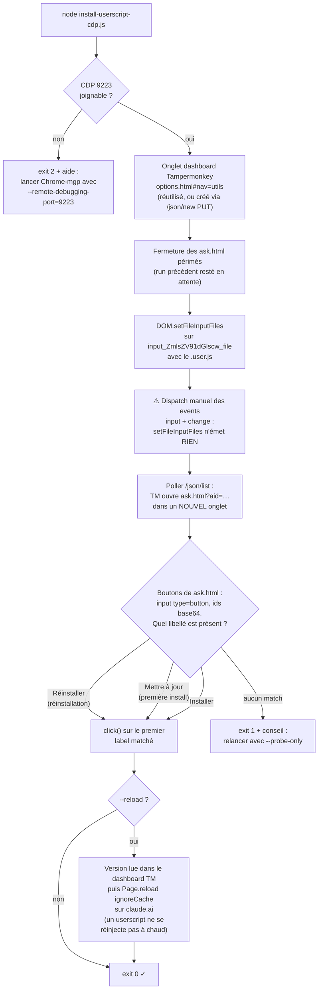

# ⚡ MEGA PACK Panel Luxe — Guide d'installation (Chrome & Brave)

> Panneau flottant dans une fenêtre macOS : **180 skills · 231 agents · 🕸 équipes ·
> ✍️ prompts perso · ★ favoris**, injectable dans Claude, ChatGPT, Gemini,
> Perplexity, Mistral… via **Tampermonkey**.
>
> Version actuelle : **2.13.2** — fichier à installer :
> [`interface/mega-pack-panel-full.user.js`](../interface/mega-pack-panel-full.user.js)

---

## 1. Installer Tampermonkey

| Navigateur | Lien direct du Chrome Web Store |
|---|---|
| Chrome | https://chromewebstore.google.com/detail/tampermonkey/dhdgffkkebhmkfjojejmpbldmpobfkfo |
| Brave | idem (Brave lit le Chrome Web Store) — bouton **« Ajouter à Chrome »** |

Cliquer **Ajouter à Chrome / Ajouter l'extension**.

## 2. Les 2 réglages OBLIGATOIRES (le piège classique)

Sans eux, le fichier `.user.js` s'affiche comme du texte au lieu de proposer l'installation,
ou le script ne s'exécute pas.

1. **Mode développeur de Tampermonkey** : icône Tampermonkey → Tableau de bord →
   **Paramètres** → Mode de configuration : **Débutant** (ou Avancé) →
   activer **Mode développeur** + **« Autoriser les scripts utilisateur »**.
2. **Accès aux URL de fichier** : ouvrir `chrome://extensions` (Brave : `brave://extensions`)
   → **Tampermonkey → Détails** → activer **« Autoriser l'accès aux URL de fichier »**.
   (Chromium peut afficher une boîte de confirmation → **Autoriser**.)

## 3. Installer le panneau

Au choix :
- **Glisser-déposer** `mega-pack-panel-full.user.js` dans la fenêtre du navigateur ;
- ou **Cmd-O** et sélectionner le fichier ;
- ou depuis GitHub : https://github.com/Azumizeus/PromptDeck/raw/master/agent-skills/interface/mega-pack-panel-full.user.js

La page Tampermonkey « Installer » apparaît → bouton **Installer**
(ou **« Mettre à jour »** si une version antérieure est déjà présente).

## 4. Tester

Ouvrir **https://claude.ai** (ou ChatGPT, Gemini…) :

- bouton rond **⚡** en bas à droite → clic → le panneau s'ouvre
  (premier lancement : visite guidée « ÉTAPE 1/9 » — normal) ;
- barre titre **« ⚡ MEGA PACK — Édition Luxe »** avec à droite
  **🎓 ⚙ Réglages ＋ FR** en **pastilles sombres bordées** (jamais de fond blanc) ;
- en-tête : « 180 skills · 231 agents » ;
- recherche « swap » → ~10 résultats, compteur dans le pied.

## 5. Mises à jour

- **Manuelle** : icône Tampermonkey → **« ⚡ Vérifier les mises à jour »**
  (compare la version installée à [`panel-version.json`](../interface/panel-version.json)
  publié sur GitHub, et propose d'ouvrir la page d'installation).
- **Badge** : une pastille **↑** apparaît dans la barre titre du panneau
  quand une version plus récente existe → un clic ouvre l'installation.
- **Automatique** : `@updateURL`/`@downloadURL` pointent vers le repo —
  Tampermonkey vérifie tout seul selon son intervalle (Paramètres → Mise à jour).

## 6. Dépannage

| Symptôme | Cause / solution |
|---|---|
| Le `.js` s'affiche en texte, pas d'installation | Accès aux URL de fichier désactivé (§2.2) → l'activer puis ré-ouvrir le fichier |
| Pas de bouton ⚡ sur la page | Mode développeur / « Autoriser les scripts utilisateur » (§2.1) ; recharger la page |
| Panneau présent mais boutons 🎓/⚙/＋/FR **blancs** | Vieille version installée (avant le fix du span `.lx`) → installer la 2.13.2 (§3) |
| Compteur « 136/177 skills · 190 agents » | Version périmée → **⚡ Vérifier les mises à jour** puis ré-installer (180·231 attendus) |
| Le panneau disparaît | Il est masqué, pas désinstallé → cliquer ⚡ pour le rouvrir |
| Chrome « ne voit pas » la nouvelle version | Tampermonkey met à jour selon son intervalle → forcer via « ⚡ Vérifier les mises à jour » |
| Réinstaller en ligne de commande (sans clic, dev/CI) | `node agent-skills/scripts/install-userscript-cdp.js --reload` — pipeline CDP complet documenté dans l'en-tête du [script](../scripts/install-userscript-cdp.js) |

## 7. Vérification automatique (dev)

```bash
# Chrome de test avec CDP (profil dédié Chrome-mgp — le profil par défaut ignore CDP) :
open -na "Google Chrome" --args \
  --user-data-dir="$HOME/Library/Application Support/Google/Chrome-mgp" \
  --remote-debugging-port=9223 --no-first-run

# Test E2E navigateur réel (local + claude.ai) : span .lx, 4 boutons, styles, ouverture :
node agent-skills/scripts/panel-e2e-browser.js          # complet
node agent-skills/scripts/panel-e2e-browser.js --quick  # local uniquement, sans réseau

# Branché au harnais complet (448 checks) :
node agent-skills/menubar-app-luxe/test-luxe.js --e2e

# Installation / réinstallation du userscript sans clic (pipeline CDP :
# dashboard TM → import fichier → ask.html → « Mettre à jour »/« Réinstaller ») :
node agent-skills/scripts/install-userscript-cdp.js --reload       # installe + recharge claude.ai
node agent-skills/scripts/install-userscript-cdp.js --probe-only   # sonde sans cliquer
node agent-skills/scripts/install-userscript-cdp-test.js           # tests unitaires (node --test)
```

L'E2E échoue si le span `.lx` disparaît, si les 4 boutons sortent du span,
si le style sombre est perdu, ou si le catalogue embarqué n'est plus à jour —
c'est le garde-fou de la régression « fond blanc » corrigée en 2.12.1/2.13.x.

### Le pipeline CDP d'installation en un coup d'œil

Le script [`scripts/install-userscript-cdp.js`](../scripts/install-userscript-cdp.js)
automatise tout le cycle d'installation/réinstallation via le protocole de
débogage de Chrome (CDP). Chaque nœud correspond à une ligne « — » du journal :



Pièges encodés dans le script (à ne pas redécouvrir) :

1. `DOM.setFileInputFiles` copie le fichier mais ne déclenche aucun événement —
   sans le dispatch manuel `input`/`change`, Tampermonkey reste muet.
2. Les boutons de `ask.html` sont des `<input type="button">`, **pas** des
   `<button>` — un sélecteur `button` ne les trouve jamais. Leurs `id` sont
   encodés base64 (ex. « Réinstaller » → `input_UulpbnN0YWxsZXJfdW5kZWZpbmVk_bu`).
3. L'ordre des regex importe : « Réinstaller » est testé **avant**
   « Installer », dont il est la sous-chaîne.
4. Après installation, la page claude.ai déjà ouverte garde l'ancienne version
   du script : le rechargement (`--reload`) fait partie du geste.
